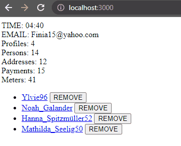

# Getting started
If you have just cloned this project, install all necessary dependencies:

### `npm install`

Then, the frontend can be started with the following command:

### `npm run dev`

And voilá, the frontend should now be up and running.

---

# Context
There is only one single component, called `App.tsx`. There is nothing in it yet. It exists only as
a placeholder for tasks to be done.

In the `.env` file, the environment variables are already configured according to the values defined
in the backend. Please use these in your coding challenge. The frontend part was created using `Vite`,
if you're unfamiliar with environment variable in `Vite`, they are accessed with the following syntax:
- `import.meta.env.ENV_VARIABLE_NAME`

Currently, there is only one variable defined, that points to the backend server to be started:
- `import.meta.env.VITE_USER_ACCOUNT_BACKEND_URL`

---

# Tasks
1) Fetch the `UserAccount` data from the backend and display it.
   1) The first element to be displayed is the current user email.

   2) The second element to be displayed is information about how many `Profile`, `PaymentMethod`,
      `Person`, `Address` and `Meter` exist within the `UserAccount`.

   3) The third element to be displayed is list with the name of each profile present in the account:
      - `Profile` (name)

2) While waiting for the backend response, display any sort of loader to show that data is currently being fetched

3) Implement a CTA next (below, above, on the side, it is your choice on how to do it) to each profile name.
    Clicking on that CTA fires a POST request to remove the profile. Just like when fetching the data, display any
    sort of loader while the deletion request is ongoing. When the request successfully finishes, the displayed
    data immediately reflects the success of deletion.

4) Each profile name should be a link that navigates to a page that shows more details of it:
   - in this page, there should be a lists of persons, payment methods, and addresses, displaying preview
        information of these in their respective lists:
        - List of `Person`: salutation and lastName
        - List of `PaymentMethod`: name
        - List of `Address`: name, street and houseNumber

5) Each element of the three lists mentioned above should also go to their own specific details page. Each page 
   should display the following data:
    - Details page of `Person`:
        - salutation, firstName and lastName (add an indicator if isPrimary is true for this person)
        - occupation
        - maritalStatus
   - Details page of `PaymentMethod`:
       - name (add an indicator if isPrimary is true for this payment method)
       - iban
       - bic
   - Details page of `Address`:
       - name (add an indicator if isPrimary is true for this address)
       - postalCode and city
       - street and houseNumber
       - number of meters belonging to this address

---   

# Bonus tasks
1) Create a timer that measures seconds and milisseconds taken to retrieve the initial data, in the format, like so:

   

      
   

   

2) Any kind of styling is definitely considered :)

---

# Important notes:
- Feel free to move, create, and update the frontend files as you wish. There is absolutely no need
to use the current components or utility files (such as `types.ts`) exactly as they are, they exist only
as placeholders / facilitators!

- We definitely would prefer to see your own css/scss/sass styles. That being said, if you believe that prototyping
with an already-built library (bootstrap, bulma, tailwind, emotion, material-ui, etc...), do use it. 

- The same goes for fetching / state libraries.
